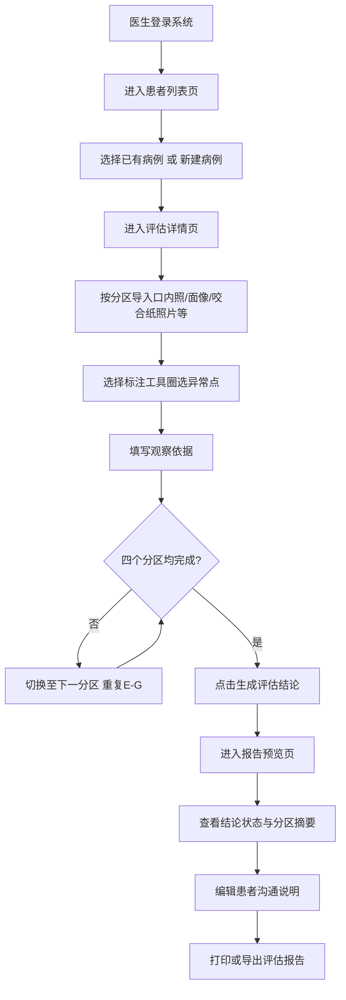

## 1. 产品概述

面向口腔诊所修复医生的 Web 咬合评估工作台，用于种植全口、活动义齿和重度磨耗病例初诊时快速整理咬合关系。系统将医生的临床经验沉淀为可追溯的标准化评估流程，覆盖病例导入、咬合标注、结论生成全链路。

- 核心价值：将主观咬合判断转化为结构化、可追溯的评估记录
- 目标用户：口腔修复科医生、诊所技术主管

## 2. 核心功能

### 2.1 用户角色

| 角色 | 注册方式 | 核心权限 |
|------|----------|----------|
| 修复医生 | 诊所内部账号 | 病例管理、咬合标注、评估结论生成、报告导出 |

### 2.2 功能模块

1. **患者列表页**：病例概览、搜索筛选、新建/删除病例、评估状态标识
2. **评估详情页**：病例资料导入分区展示、咬合图像标注、观察依据录入
3. **报告预览页**：评估结论汇总、状态判定、患者沟通说明、报告导出

### 2.3 页面详情

| 页面名称 | 模块名称 | 功能描述 |
|----------|----------|----------|
| 患者列表页 | 顶部导航栏 | 诊所名称、医生信息、新建病例按钮 |
| 患者列表页 | 搜索筛选区 | 按姓名/编号搜索、按评估状态筛选、按病例类型筛选 |
| 患者列表页 | 病例卡片列表 | 患者基本信息、病例类型、评估进度、最近更新时间、快捷操作 |
| 评估详情页 | 患者信息条 | 姓名、性别、年龄、病例类型、返回列表按钮 |
| 评估详情页 | 分区标签导航 | 正中关系、垂直距离、覆盖覆合、偏斜情况四个评估分区切换 |
| 评估详情页 | 图像展示区 | 多图上传展示、缩略图切换、大图预览、缩放拖拽 |
| 评估详情页 | 标注工具栏 | 早接触/咬合干扰/中线偏移/颌位不稳定标注工具切换、撤销/清空 |
| 评估详情页 | 标注观察面板 | 标注点列表、观察依据文本输入、编辑删除标注 |
| 评估详情页 | 底部操作栏 | 保存草稿、上一分区/下一分区、生成评估结论 |
| 报告预览页 | 评估结论卡 | "需复核"/"可进入修复设计"/"建议先行调整"三态判定、结论依据汇总 |
| 报告预览页 | 分区评估摘要 | 四个分区的标注统计和关键发现 |
| 报告预览页 | 患者沟通说明 | 自动生成简明易懂的说明文本、支持编辑微调 |
| 报告预览页 | 操作栏 | 返回编辑、打印报告、导出 PDF |

## 3. 核心流程

## 4. 用户界面设计

### 4.1 设计风格

- **主色调**：深蓝灰 #1E2A3A（专业、沉稳），辅色蓝绿 #2A9D8F（医疗、信任），强调色橙 #E9C46A（警示、重点）
- **按钮风格**：直角微圆角（4px），实色填充主按钮，线框次要按钮，按压态微下沉
- **字体**：中文采用思源黑体 / PingFang SC，英文采用 Roboto Mono 标注编号；标题 18-20px 粗体，正文 14px 常规，辅助文字 12px
- **布局风格**：左右分栏主布局，卡片式信息承载，清晰的分区边界线，大量留白突出临床图像
- **图标风格**：线性细描边图标（2px 线宽），标注点采用彩色圆形编号标记

### 4.2 页面设计概览

| 页面名称 | 模块名称 | UI 元素 |
|----------|----------|---------|
| 患者列表页 | 病例卡片 | 左侧患者头像占位 + 编号，中部姓名/类型/更新时间，右侧评估状态色标 + 操作按钮 |
| 评估详情页 | 图像展示区 | 大图居中展示，左侧缩略图垂直列表，右侧悬浮标注工具栏，底部缩放控制 |
| 评估详情页 | 标注工具 | 四种工具以图标按钮排列，选中态蓝绿高亮，对应不同颜色标记点 |
| 评估详情页 | 观察面板 | 标注点按编号排列，点击可定位图像，下方文本域录入依据 |
| 报告预览页 | 结论卡 | 大号状态图标 + 三态颜色（橙=需复核、绿=可进入、黄=建议调整），结论依据条目化 |
| 报告预览页 | 沟通说明 | 卡片内可编辑文本区，预置模板自动填充，支持一键复制 |

### 4.3 响应式

- 桌面端优先设计（最小支持 1366×768），图像标注区不做移动端适配
- 患者列表在平板端卡片变为两列，手机端单列
- 报告预览页支持 A4 打印样式，打印时隐藏导航与操作栏

### 4.4 动效与微交互

- 页面切换采用左右滑动过渡（200ms ease-out）
- 标注点创建时有脉冲扩散动画，悬停显示观察摘要气泡
- 保存操作有顶部 Toast 提示（成功绿、警告橙、错误红）
- 结论生成时有骨架屏加载态（800ms），模拟评估计算过程
