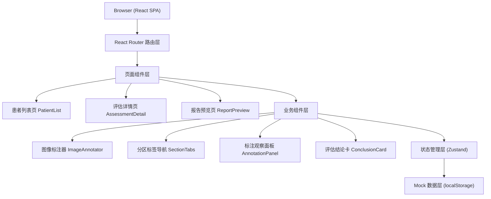
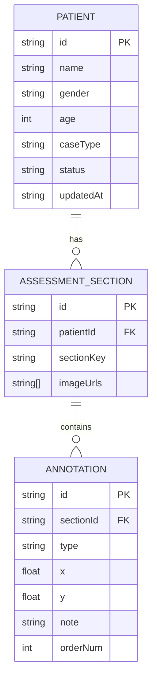

## 1. 架构设计



## 2. 技术说明

- **前端框架**：React@18 + TypeScript + Vite@5
- **样式方案**：TailwindCSS@3（原子化 CSS）+ CSS 变量管理主题色
- **状态管理**：Zustand（轻量级 store，管理病例数据、标注状态、UI 状态）
- **路由**：React Router DOM@6
- **图标**：Lucide React（线性细描边图标库）
- **图像标注**：基于 Canvas API 自研轻量标注组件（支持缩放、拖拽、点标注）
- **数据持久化**：localStorage 存储 Mock 病例数据与标注记录
- **后端**：无，纯前端 SPA，使用本地 Mock 数据模拟完整流程

## 3. 路由定义

| 路由 | 页面组件 | 用途 |
|------|----------|------|
| `/` | 重定向至 `/patients` | 根路径跳转 |
| `/patients` | `PatientList` | 患者列表页，展示所有病例 |
| `/patients/:id/assessment` | `AssessmentDetail` | 评估详情页，分四区进行图像导入与咬合标注 |
| `/patients/:id/report` | `ReportPreview` | 报告预览页，展示评估结论与患者沟通说明 |

## 4. 数据模型

### 4.1 数据模型定义



### 4.2 TypeScript 类型定义

```typescript
// 病例类型
type CaseType = 'implant-full' | 'removable-denture' | 'severe-wear';
// 评估状态
type AssessmentStatus = 'draft' | 'in-progress' | 'completed';
// 评估分区
type SectionKey = 'centric-relation' | 'vertical-dimension' | 'overjet-overbite' | 'deviation';
// 标注类型
type AnnotationType = 'early-contact' | 'occlusal-interference' | 'midline-deviation' | 'jaw-instability';
// 结论状态
type ConclusionStatus = 'review-required' | 'ready-for-design' | 'adjustment-recommended';

interface Patient {
  id: string;
  name: string;
  gender: 'male' | 'female';
  age: number;
  caseType: CaseType;
  status: AssessmentStatus;
  updatedAt: string;
  sections: Record<SectionKey, AssessmentSection>;
}

interface AssessmentSection {
  key: SectionKey;
  label: string;
  images: SectionImage[];
  annotations: Annotation[];
}

interface SectionImage {
  id: string;
  url: string;
  name: string;
}

interface Annotation {
  id: string;
  type: AnnotationType;
  imageId: string;
  x: number; // 百分比坐标 0-100
  y: number;
  note: string;
  orderNum: number;
}

interface AssessmentConclusion {
  patientId: string;
  status: ConclusionStatus;
  summary: string[];
  sectionSummaries: Record<SectionKey, SectionSummary>;
  patientExplanation: string;
  generatedAt: string;
}

interface SectionSummary {
  annotationCount: number;
  keyFindings: string[];
  riskLevel: 'normal' | 'mild' | 'moderate' | 'severe';
}
```

## 5. 目录结构

```
src/
├── components/
│   ├── layout/           # 布局组件（TopBar, Container）
│   ├── patient/          # 患者列表相关组件
│   ├── assessment/       # 评估详情相关组件
│   │   ├── SectionTabs.tsx
│   │   ├── ImageAnnotator.tsx
│   │   ├── AnnotationPanel.tsx
│   │   └── ThumbnailList.tsx
│   ├── report/           # 报告页相关组件
│   │   ├── ConclusionCard.tsx
│   │   ├── SectionSummaryCard.tsx
│   │   └── PatientExplanation.tsx
│   └── ui/               # 通用 UI（Button, Modal, Toast, Badge）
├── pages/
│   ├── PatientList.tsx
│   ├── AssessmentDetail.tsx
│   └── ReportPreview.tsx
├── store/
│   ├── usePatientStore.ts    # 病例数据管理
│   └── useUIStore.ts         # UI 状态（Toast, Loading）
├── types/
│   └── index.ts          # 全局类型定义
├── data/
│   └── mockPatients.ts   # Mock 病例数据（含预置图像与标注示例）
├── utils/
│   ├── conclusion.ts     # 结论生成逻辑
│   └── annotation.ts     # 标注坐标工具函数
├── styles/
│   └── index.css         # Tailwind 指令 + 全局 CSS 变量
├── App.tsx
├── main.tsx
└── router.tsx
```

## 6. 核心交互实现说明

1. **图像标注**：在 `<canvas>` 上叠加绝对定位的标注点 DOM 元素，支持图像缩放（transform scale）与拖拽（translate），标注坐标以图像百分比存储（0-100），保证跨尺寸一致性。
2. **结论生成算法**：基于四个分区的标注数量、类型分布进行权重评分，映射至三态结论；预置规则库，如"早接触≥3 个"或"存在颌位不稳定"触发"建议先行调整"。
3. **患者沟通说明模板**：根据结论状态与分区发现自动拼接模板文本，医生可在预览页编辑覆盖。
4. **数据持久化**：Zustand store 变更时自动同步至 localStorage，页面刷新后恢复。
